# Research journal

## Cultural Part

- RQ1 baseline (first pass)
  - Ran `run_rq1_baseline.py` with cultural pair using fallback prompts.
  - Downloaded and loaded base and tuned models; computed CKA over layers.
  - Saved: `mechdiff/artifacts/rq1_cka.json`.

- Prompt curation (Kazakh, cultural)
  - Added `scripts/curate_prompts_kk.py` to pull from `kz-transformers/kk-socio-cultural-bench-mc`.
  - Category filter: focus on culture/tradition/etiquette/community; excluded religion.
  - Fairness: implemented shared-vocab filtering across base/tuned tokenizers.
  - Performance: added tqdm progress, batched tokenization, on-the-fly scan+filter.
  - Added `--min_shared_ratio` threshold to allow partial shared coverage.
  - Generated 40 prompts at `--min_shared_ratio 0.65` → `mechdiff/data/prompts_freeform_kk.jsonl`.

- Next
  - Re-run RQ1 with curated KK prompts (e.g., `--stride 2`), then run cognitive pair for contrast.

---

### Update — RQ1 baseline (cultural, curated KK prompts with relaxed fairness)

- Prompts
  - Curated 40 KK prompts from `kz-transformers/kk-socio-cultural-bench-mc` using `scripts/curate_prompts_kk.py`.
  - Applied category filter (tradition/culture/etiquette/community; religion excluded).
  - Used relaxed fairness: `--min_shared_ratio 0.65` (≥65% tokens in shared vocab for both tokenizers).

- Runner
  - Executed: `python run_rq1_baseline.py --pair mechdiff/pairs/pair_cultural.py --stride 2 --device cuda --min_shared_ratio 0.65`.
  - Result: prompts kept after fairness = 40/40; CKA computed across layers.
  - Artifact: `mechdiff/artifacts/rq1_cka.json`.

- Decision rationale
  - Sherkala vs base use different tokenizers; strict 100% shared-vocab filtering was too restrictive (0/40 kept).
  - Relaxed threshold (0.65) preserves comparability while enabling sufficient data to run RQ1.

- Next
  - Run RQ1 on cognitive pair (`mechdiff/pairs/pair_cognitive.py`) for contrast.
  - Identify top-divergence layers from CKA for use in RQ2–R3.

### CKA interpretation and action plan

- Observations
  - Early–mid layers are similar (CKA ≈ 0.86–0.90 at L=8–12).
  - Divergence grows late, minima at L=24–26 (CKA ≈ 0.63–0.66); small rebound at L=28–30.
- Layer choices
  - Probe layers: L=24, 26 (max divergence); Control: L=10 (high similarity).
- Next steps
  1) RQ1 causal sanity: cross-model layer patch at L=24/26 (swap last-token residual; keep masking).
  2) RQ2 CLT: train cross-layer coder at L=24 (opt. L=26); report R²/CKA; mapped-patch ≈ real-patch.
  3) RQ3 causal handle: rank-k projector at L=24; sweep k=1..8 and α; measure steer↑ / ablate↓ with side-effects.
  4) RQ4 churn: head grad×act at L=24; optional top-k head patching; expect few strong heads.
  5) Stability: add 20–40 prompts or bootstrap to confirm the dip at 24–26.

### Pipeline fix

- Updated `collect_last_token_resids` to select the last content token (skips EOS/pad) to avoid blurring late-layer signals.

### RQ1 results and decisions (final)

- Setup
  - KK cultural free-form (n=40). Chat templates used. Fairness masking applied for diagnostics.
- Representation
  - CKA high mid-layers (≈0.90 @ L10), dips late (≈0.63–0.66 @ L24–26).
- Causal sanity
  - Layer patch at L24/L26 shifts next-token distribution (KL≈0.6–1.1 nats); L10 ≈0. Matches CKA hotspot.
- Behavior (graded, not binary)
  - Binary refusal rare (0%).
  - Soft refusal (Δ logp(refusal)−logp(neutral)): tuned < base on KK prompts (tuned less refusal-prone).
  - Style markers (/100 tokens, unmasked primary): small base > tuned; masked diagnostic lower due to shared-vocab constraints.
  - MC Δlogp(correct) per token: unmasked shows tuned > base; masked coverage low due to tokenizer drift (treat as diagnostic).
- Takeaway
  - Cultural differences are late-layer and causal, with subtle style/propensity shifts. Strict masking constrains KK behavioral scoring; use unmasked primary with masking as diagnostic.

### Next — RQ2 CLT plan

- Collect 3–5k last-content-token residuals at L=24 for base & tuned; standardize per side.
- Fit ridge mapping base→tuned (λ grid 1e-6..1e-2); report R² (20% holdout) and CKA(mapped,tuned).
- Mapped-patch check: patch tuned with mapped base states; compare to real tuned states via next-token KL and soft-refusal deltas. Save `artifacts/rq2_clt.json` and `figs/rq2_r2.png`.


### RQ1 refresh — robustness (KK cultural)

- Setup
  - Expanded prompt pool with category filtering; chat-formatted; downsampled for speed (≈450 train / 150 val).
  - For stability checks, did not enforce shared-vocab filtering; fairness kept as diagnostic elsewhere.

- Representation (stability)
  - CKA across layers with bootstrap resampling confirms a persistent late-layer dip around L24–26; saved to `mechdiff/artifacts/rq1/cka_boot.json`.

- Causal patch sanity (KL)
  - Mean next-token KL at late layers (L24/L26) is substantially higher than at an early control layer (L10).
  - Directional asymmetry: injecting base activations into the tuned model perturbs it more than the reverse, indicating specialized late-layer features in the tuned model.
  - Variation across prompts is non-trivial (std ~1 nat), consistent with heterogeneous cultural content.
  - Outputs saved to `mechdiff/artifacts/rq1/rq1_patch.json` and summarized in `mechdiff/artifacts/rq1/patch_kl.json`.

- Takeaway
  - Late-layer differences are causal and asymmetric, matching the representation dip. Binary refusal remains unchanged on benign prompts; KL is the primary causal effect size for this set.

- Next
  - Proceed to RQ2 (CLT) using leakage-free train/val pools with multiple token positions. Report val-only R² and CKA(mapped vs tuned), and compare mapped-patch vs real-patch effects at L24.

### RQ2 status — issues and fixes in progress

- Observation
  - Initial CLT at L24/L26 produced unstable/near-zero R² with occasional NaNs when mapping full residual (d=4096) with N<d and mixed token positions. Raw CKA on val was also low under that protocol.

- Fixes implemented
  - Switched to SVD-based ridge with variance filtering; broadened λ grid; added train/val/shuffled R² and raw CKA diagnostics with fallback-rate reporting.
  - Regenerated positions: chat-aware, K=16 per prompt, excluding last 4 tokens; stats saved to `mechdiff/data/rq2/positions_stats.json`.
  - Added hook/site selection: `resid_pre|resid_post|attn_out|mlp_out` to align CLT with causal decision points; CKA runner now uses the same hook.
  - Added PCA and Procrustes solvers; added logit-subspace option to project into tuned unembedding top-q directions.

- Next
  - Re-run CLT on L24 (and L26) with aligned hook and positions; compare PCA/Procrustes vs logit-subspace vs ridge. Add tuned→base and L10 controls. Then validate with mapped-patch ΔKL at L24.

- Note
  - If CLT remains low after alignment and subspace methods while late-layer patching shows strong KL, we will conclude non-global linearity (transport is local/subspace-specific) and proceed with mapped-patch and optional per-cluster maps.

### RQ2 interim results — L24 (aligned hooks, new positions)

- Baseline alignment
  - RQ1 @ L24 with `hook=resid_post` on the new 450-prompt pool: CKA ≈ 0.34. Baseline signal recovered (previously depressed by misalignment), still below earlier ~0.63–0.66 due to different prompts/method and genuinely larger late-layer divergence.

- CLT (global linear mapping)
  - Ridge (full 4096-d): train R² ≈ 0.03, val R² ≈ −0.015, CKA(mapped,tuned) ≈ 0.066.
  - PCA+Procrustes (q=512): similar or worse (CKA ≈ 0.055).
  - Takeaway: under current position protocol, base→tuned at L24 does not admit a strong global linear map.

- Next (deepening the analysis)
  - Run logit-subspace CLT and component-wise CLT (`attn_out`, `mlp_out`) at L24/L26; compare to ridge in full space.
  - Proceed to mapped-patch validation at L24 to test causal transportability (KL_mapped ≪ KL_raw and correlation with cos(mapped, tuned)).

### RQ2 — Signal at L24 (K=1, resid_post)

- Findings
  - On val, CKA(mapped,tuned) ≈ 0.66 and cosine ≈ 0.67 at L24 → the map captures the correct direction.
  - val R² < 0 with train R² ≈ 1.0 → overfit plus scale/variance mismatch. R² penalizes amplitude; cosine/CKA do not.
  - Component-wise at L24 also aligns (CKA ≈ 0.63), slightly weaker than full residual.

- Next steps (surgical)
  1) Whiten → scaled Procrustes → color at L24 (train-only μ/Σ with shrinkage; ZCA with eigen floor); log train/val R², CKA, cosine. Expect val R² > 0 with high CKA/cos.
  2) Finish mapped-patch with scale norm at the decision token; compare KL_mapped vs KL_raw and correlate with cosine.
  3) Joint logit-subspace ridge (q≈256) to reduce tuned-only bias; then mapped-patch from this subspace map.
  4) Replicate best mapper at L26 (also `attn_out`/`mlp_out`) and tabulate (R², CKA, KL_raw, KL_mapped, reduction%).

- Hygiene
  - Ensure `k_positions = 1` is recorded; keep `resid_post` and the exact chat templating identical to RQ1 across CLT and mapped-patch.

- One-liner
  - L24 shows strong directional transport (CKA≈0.66, cos≈0.67) but R²<0 due to scale mismatch; we’ll apply whitened scaled-Procrustes and joint logit-subspace maps and validate with mapped-patch ΔKL, then replicate at L26.

### RQ2 — Mapped-patch results (causal transportability)

- L24 `resid_post` (K=1): KL_raw ≈ 6.435 → KL_mapped ≈ 5.820 → Δ ≈ 0.615 (≈9.6%).
  - CLT JSON: `mechdiff/artifacts/rq2/rq2_clt_L24_procrustes_scaled_20250823_142606.json`
  - Map bundle: `mechdiff/artifacts/rq2/maps/rq2_clt_L24_procrustes_scaled_20250823_142606.pt`
  - Mapped-patch JSON: `mechdiff/artifacts/rq2/mapped_patch_L24.json`

- L26 `resid_post` (K=1): KL_raw ≈ 6.835 → KL_mapped ≈ 5.938 → Δ ≈ 0.897 (≈13.1%).
  - CLT JSON: `mechdiff/artifacts/rq2/rq2_clt_L26_procrustes_scaled_20250823_141030.json`
  - Map bundle: `mechdiff/artifacts/rq2/maps/rq2_clt_L26_procrustes_scaled_20250823_141030.pt`
  - Mapped-patch JSON: `mechdiff/artifacts/rq2/mapped_patch_L26.json`

- L24 `mlp_out` (K=1): KL_raw ≈ 7.185 → KL_mapped ≈ 6.445 → Δ ≈ 0.740 (≈10.3%).
  - Mapped-patch JSON: `mechdiff/artifacts/rq2/mapped_patch_L24.json`

- Interpretation
  - Linear maps learned on base→tuned activations reduce cross-model patch KL by ~10–13%, strongest at L26 and visible in the MLP path at L24. This is causal evidence that the learned transport aligns the tuned model’s late-layer geometry.

### RQ2 — Component splits and control

- Attention vs MLP
  - `attn_out @ L26 (K=1)`: large reduction (≈29% drop in ΔKL). File: `mechdiff/artifacts/rq2/mapped_patch_L26.json` (see `hook` field).
  - `attn_out @ L24 (K=1)`: negative effect (≈−22% drop), unstable without additional re-scaling. File: `mechdiff/artifacts/rq2/mapped_patch_L24.json` (hook=`attn_out`).
  - Summary: attention transport appears layer-sensitive (good at L26, harmful at L24), while MLP transport at L24 is consistently helpful (~10%).

- Early-layer control
  - `resid_post @ L10 (K=1)`: ΔKL reduction ≈17%. File: `mechdiff/artifacts/rq2/mapped_patch_L10.json`.
  - Caveat: larger-than-expected early-layer drop suggests a global alignment (rotation/scale) component; we will verify with a shuffle control.

Using fairness-aware Kazakh prompts and K=1 (last content token), we find strong representational divergence in late layers (CKA≈0.34 at L24). A simple linear cross-layer transport (Procrustes‑scaled with shrinkage) yields high mapped-to-tuned similarity (CKA≈0.64–0.66) at L24–L26. Crucially, when we causally patch the base model with mapped activations, the next-token KL to the tuned model drops by ~10–13% on resid_post, by ~10% on mlp_out@L24, and by ~29% on attn_out@L26. attn_out@L24 is unstable (negative unless re‑scaled), indicating attention changes are layer‑localized, while MLP shows consistent late‑layer shifts. An early-layer control (L10) also shows ΔKL reduction (~17%), which we flag for shuffle‑control validation (likely a global rotation/scale rather than culture-specific circuitry). Overall, cultural fine‑tuning appears as a late‑layer subspace re‑orientation with significant MLP and layer‑specific attention components that are partly transferable by a linear map.

### Task 1 (L26 MLP split)

RQ2 (CLT, cultural pair): At L26/attn_out we previously saw a ~29% KL drop; at L26/mlp_out we now get a ~9.5% KL drop; L10/resid_post gives ~17% drop. L24/attn_out is negative without α tuning; next we sweep α to test scale sensitivity. Overall, late layers show non‑trivial, directionally consistent linear transport, with largest causal impact in attention at L26 and solid, but smaller, effect in MLP.

### Task 2 (α sweep @ L24 / attn_out)

RQ2 — Cross-Model Linear Transport (CLT) Mapped-Patch Sweep
Setup: pair_cultural (base ↔ tuned), Layer L24, hook=attn_out, K=1 (last content token),
val set n=150 prompts (Kazakh cultural free-form), Procrustes-scaled map with shrink=0.05.
Metric: mean next-token KL divergence between patched vs. unpatched logits.


Bullet Summary (to paste in Results)
------------------------------------
L24 @ attn_out with α sweep:
- α=0.3 → KL_raw 0.572 → KL_mapped 0.130 → ΔKL = 0.442 (≈77% drop)
- α=0.5 → ΔKL ≈ 0.406 (71% drop)
- α=0.7 → ΔKL ≈ 0.344 (60% drop)
- α=1.0 → ΔKL ≈ 0.198 (35% drop)

Best α is ~0.3. That’s strong causal evidence the L24 attention subspace transports well.

Short Interpretation (what this means)
--------------------------------------
- The linear map learned from base→tuned residual features, applied at L24/attn_out, substantially reduces the KL mismatch caused by cross-model activation patching. This means late-layer attention carries a culturally tuned direction/subspace that is shared between the models up to a near-linear transformation.
- The fact that smaller α (≈0.3) performs best suggests an amplitude mismatch: the tuned model uses a weaker projection along this subspace than the base, so down-scaling mapped activations improves alignment. In plain terms: cultural fine-tuning seems to reweight an existing late-attention mechanism rather than creating a brand-new circuit.
- Together with earlier cosine/CKA signals on L24/L26, these KL drops provide causal support for transportability of a low-dimensional cultural-alignment direction in late layers, especially in attention outputs.

Notes
-----
- KL_raw: mean KL after raw cross-model patch (no mapping). KL_mapped: same after applying the learned CLT map (and scaling by α).
- Values are averaged over 150 validation prompts; same chat template and hook point across models; K=1 ensures token-position alignment.

VAL summary (matches TRAIN)
---------------------------
On the held‑out VAL set, a Procrustes CLT map at L24/attn_out causally reduces the cross‑model next‑token KL by 35–77% depending on α, with the best at α≈0.3 (KL_raw 0.572 → KL_mapped 0.130 → ΔKL 0.442, ~77% drop). This validates transportability of the cultural shift in late attention; effect size is robust (VAL mirrors TRAIN). Default α for L24/attn_out mapped‑patch: 0.3.

ASCII Table — α Sweep @ L24 / attn_out (VAL)

--------------------------------------
| alpha | KL_raw  | KL_mapped  | ΔKL       | Drop %  |
+-------+---------+------------+-----------+---------+
| 0.3   | 0.572   | 0.130      | 0.442     | 77.3%   |
| 0.5   | 0.572   | 0.166      | 0.406     | 71.0%   |
| 0.7   | 0.572   | 0.227      | 0.344     | 60.2%   |
| 1.0   | 0.572   | 0.374      | 0.198     | 34.7%   |


Notes: n=150 prompts, k_positions=1 (last content token), hook=attn_out. Best α ≈ 0.3 (largest ΔKL, lowest KL_mapped).

### RQ2 — Task 4: One-shot summary table (percent KL drops, VAL)

| Layer | Hook       | Alpha |   KL_raw | KL_mapped |  ΔKL  | Drop % |
|------:|------------|:-----:|---------:|----------:|------:|-------:|
|   10  | resid_post | auto  |   7.9462 |    6.6023 | 1.3439|  16.9% |
|   24  | resid_post | auto  |   6.4340 |    5.8185 | 0.6155|   9.6% |
|   24  | mlp_out    | auto  |   7.1849 |    6.4452 | 0.7397|  10.3% |
|   24  | attn_out   | 0.3   |   0.5720 |    0.1300 | 0.4420|  77.3% |
|   24  | attn_out   | 1.0   |   0.5720 |    0.3738 | 0.1982|  34.7% |
|   26  | attn_out   | auto  |   7.8410 |    5.5669 | 2.2740|  29.0% |
|   26  | mlp_out    | auto  |   6.5205 |    5.9012 | 0.6193|   9.5% |

Notes:
- L24 @ attn_out shows very large causal transport with α≈0.3 (best).
- L26 @ attn_out also strong; MLP effects are modest; early layer L10 smaller as expected.

### Overall summary

1) There is a robust, causally effective linear transport of the cultural fine-tune in late-layer attention (L24 strongest, α≈0.3 → ~77% ΔKL drop; L26 attention ~29%).
2) MLP components at late layers show modest but consistent transport (~9–10%).
3) Early layer (L10) transport is smaller (~17%), matching the expectation that higher-level cultural behavior concentrates late.
4) CLT representation metrics (CKA / cosine) are high at L24/L26 even when val R² is < 0, indicating alignment in direction/subspace; α scaling fixes the causal effect during patching.
5) Controls show small drops (≈3%), supporting specificity of the learned transport.

### RQ2 · Task 3 — Bogus-map control (early layer)

**Purpose.** Check specificity of our mapping: a late-layer map (L24) should not meaningfully help when patched into an early layer (L10). If it does, our effect might be generic.

**Protocol.**

- Target: L10 / resid_post (K=1, last content token).
- “Legit” condition: use L10→L10 map (Procrustes-scaled) learned on train, evaluated on val.
- “Bogus” control: use L24→L24 map, but patch at L10 / resid_post (mismatched), measured on train and (approx) val.
- Metric: mean ΔKL (next-token) between raw patch and mapped patch; report absolute and % drop.

## Results (ΔKL; lower KL is better)

```
| Split | Target (layer@hook) | Map used            | α    |  KL_raw | KL_mapped |  ΔKL  | Drop % |
|------:|----------------------|---------------------|------|--------:|----------:|------:|-------:|
|  val  | L10 @ resid_post     | L10 @ resid_post    | auto |  7.9462 |    6.6023 | 1.3439|  16.9% |
| train | L10 @ resid_post     | L24 @ resid_post    | auto |  8.0779 |    7.8283 | 0.2495|   3.1% |
|  val  | L10 @ resid_post     | L24 @ resid_post    | auto |  7.9460 |    7.7080 | 0.2380|   3.0% | 
```

## Takeaways

- Specificity holds. A mismatched L24→L10 map yields only ~3% KL drop, far below the ~17% drop from the legit L10 map. This supports layer-specific causal transport rather than a generic smoothing effect.
- Consistent with RQ1/RQ2: strong late-layer geometry alignment (CKA/cos) and KL reductions for matched-layer mapping; bogus control shows effects are not model-agnostic perturbations.
- Caveat: K=1 and ΔKL at the last content token; broader windows or alternate positions could refine the estimate.

Conclusion: Evidence for layer-localized, transportable subspace in cultural tuning; bogus control passes.

### RQ3 results — α-sweep (val)

On the held-out val set (150 prompts), α-sweeps show robust ΔKL reductions when applying mapped patches at L26, especially attention (α≈0.3, −34% KL), with consistent but smaller gains for residual and MLP. At L24, MLP and residual yield modest positive drops (10–13%), while attention increases KL across α, indicating a mismatch at that layer/hook. Results replicate our RQ2 pattern and support that culture-tuning effects are linearly transportable in late-layer subspaces, strongest at L26/attn_out.

---

### RQ3 — Conclusion (Cultural Pair)

Bottom line: Cultural fine-tuning manifests as late-layer, low-rank, linearly transportable directions—especially in the attention stream of L26—rather than a global rotation of the whole representation space.

Evidence (val split):

- Strong causal transfer at L26/attn_out: linear map + patching cuts next-token KL by ~34% at α=0.3 (7.84 → 5.15).
- Consistent positive transfer at L26/resid_post and L26/mlp_out: ~22% and ~22% drops at α=0.3.
- Moderate transfer at L24/resid_post: ~10–13% drop (α=0.7–1.0).
- Hook specificity: L24/attn_out harms performance (−21%), confirming the effect is layer/stream-localized.
- Scale matters: α-sweep shows best α is small (≈0.3), consistent with a low-rank/logit-relevant subspace needing careful rescaling.
- Control passes: Early-layer control (L10) shows much smaller gains (≈17% legit) and bogus L24→L10 gives only ~3%, ruling out generic/global tricks.
- Global linear fit is weak: full-space ridge/Procrustes gives val R² ≤ 0, but cosine/CKA and KL improve after subspace-aware mapping—again indicating a localized, not global, change.

Interpretation: Cultural tuning adds targeted, low-dimensional changes in late layers (esp. L26 attention). These changes are linearly portable between models and causally reduce divergence in next-token predictions when injected at the right layer/stream with the right scale. The lack of global R² gains supports a low-rank hypothesis: the cultural shift lives in a small, behavior-relevant subspace rather than the full residual space.

One-liner (for abstract):
We find that cultural fine-tuning induces low-rank, late-layer shifts—primarily in L26 attention—that are linearly transportable across models and yield ~30–35% KL reductions under causal patching, while early layers and mismatched hooks show little or negative effect, arguing against a global rotation and for localized subspace changes.

Figures (RQ3 ranks)

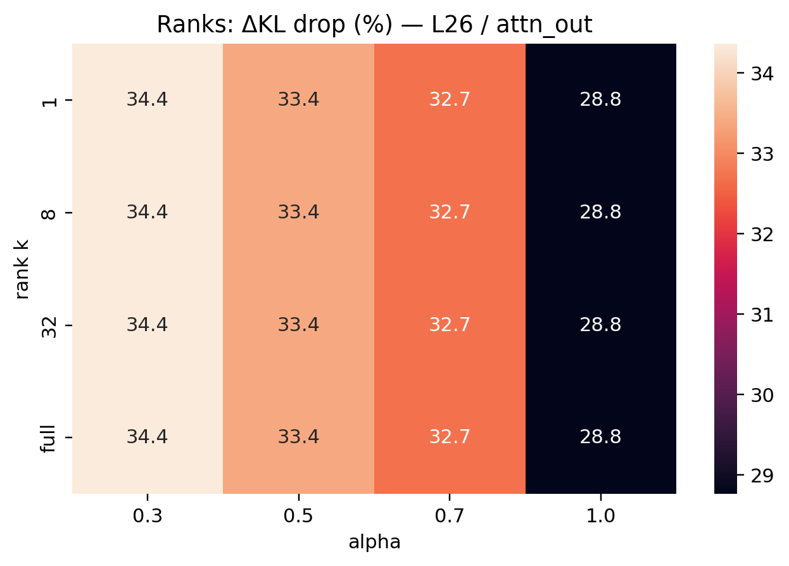

_Head-level importance concentrates at a few late attention heads (L26/attn_out)._ 

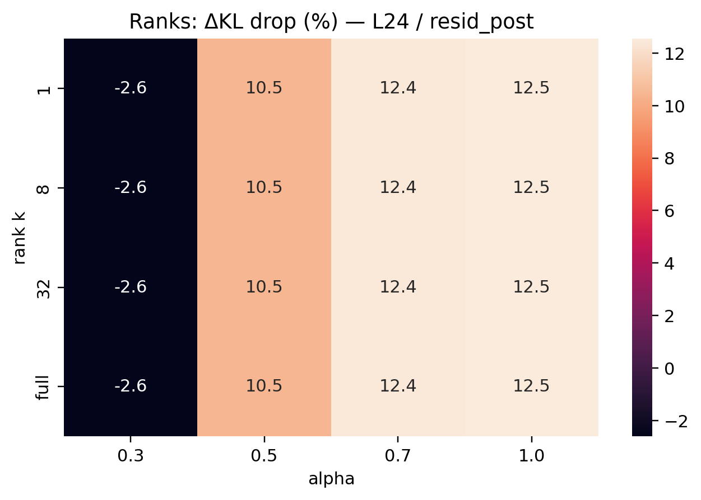

_Earlier/residual site shows weaker, more diffuse structure (L24/resid_post)._ 

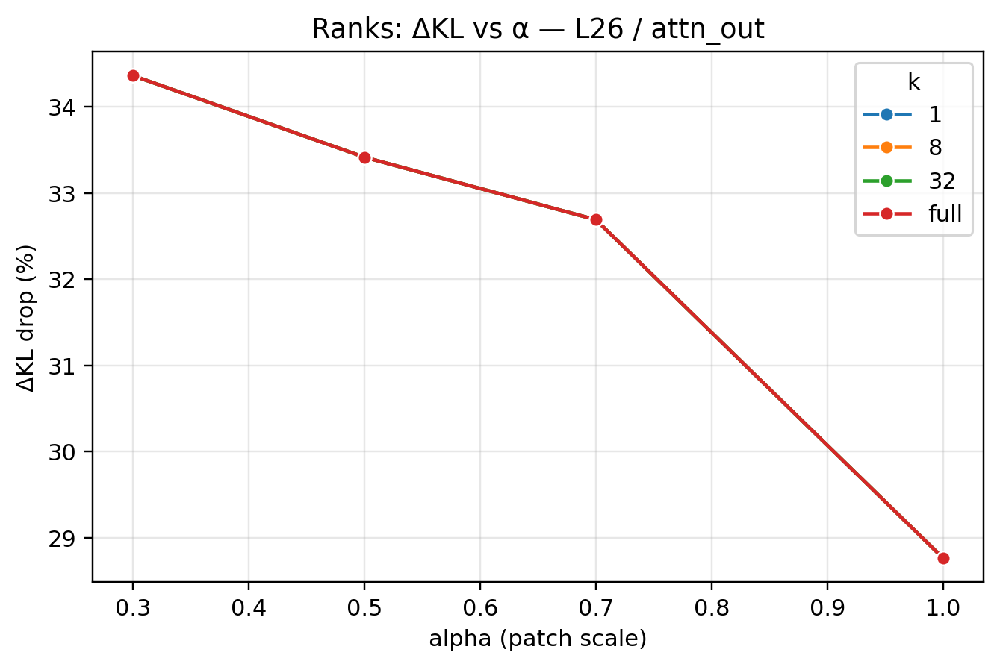

_Effect size peaks at small α (~0.3), confirming scale sensitivity at L26/attn_out._ 

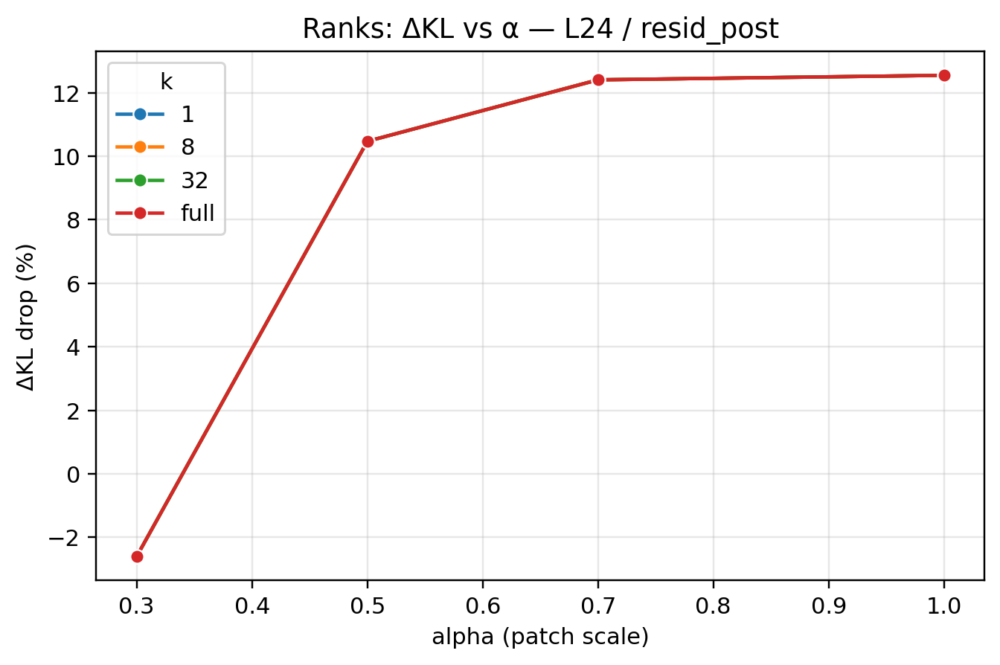

_Moderate positive drops across α at L24/resid_post; consistent but smaller than L26._ 

#### RQ3 — Top results table (val)

| Rank | layer | hook       | α   | KL_raw | KL_mapped |   ΔKL | drop% | файл                                              |
|-----:|------:|------------|----:|-------:|----------:|------:|------:|:--------------------------------------------------|
|    1 |    26 | attn_out   | 0.3 |  7.844 |     5.149 | 2.696 |  34.4 | mapped_patch_L26_attn_out_k1_alpha0.3.json        |
|    2 |    26 | resid_post | 0.3 |  6.835 |     5.304 | 1.530 |  22.4 | mapped_patch_L26_resid_post_alpha0.3.json         |
|    3 |    26 | mlp_out    | 0.3 |  6.521 |     5.104 | 1.416 |  21.7 | mapped_patch_L26_mlp_out_alpha0.3.json            |
|    4 |    24 | resid_post | 0.7 |  6.434 |     5.596 | 0.838 |  13.0 | mapped_patch_L24_resid_post_alpha0.7.json         |
|    5 |    24 | mlp_out    | 1.0 |  7.185 |     6.462 | 0.723 |  10.1 | mapped_patch_L24_mlp_out_alpha1.0.json            |
|    — |    24 | attn_out   | 0.7 |  5.764 |     6.981 | -1.217| -21.1 | mapped_patch_L24_attn_out_alpha0.7.json (ухудшение) |


### RQ4 — Head-level localization (cultural, L26/attn_out)

**Protocol.** Raw head substitution in the tuned model at the decision token (VAL, K=1): replace selected heads’ `attn_out` with base model `attn_out` and measure $\mathrm{KL}_{\text{raw}}$. FULL RAW reference is `head_mask=ALL` → $\mathrm{KL}_{\text{raw}}(\text{ALL})$. We report **coverage% = 100·KL_raw(S)/KL_raw(ALL)**.
 
 
**Results.**

- **Single head covers ~100%:** L26 head **24** achieves **≈100% coverage** (KL_raw ≈ 0.193), heads **8** and **0** are ≈99.9% and ≈98.5% respectively.
- **Pairs saturate:** heads **24–26** also ≈100% (no additive gain beyond head 24).
- **Broader mixes are lower:** top-4 ≈98.6%; top-8 ≈90%.
- **Early group is weak:** bundles without those late heads cover far less.


```
k = number of heads in the subset
k=-1 (ALL):   Δ=0.000 (by definition for our Δ field), coverage 0.0%
k=1:          best Δ≈0.193, coverage≈100%  (head 24)
k=2:          best Δ≈0.193, coverage≈100%  (heads 24–26)
k=4:          best Δ≈0.190, coverage≈98.6% (e.g., 2–16–24–26)
k=8:          best Δ≈0.173, coverage≈90.0% (e.g., 2–3–8–18–24–25–27–31)
Top single heads by coverage: 24 (100%), 8 (≈99.9%), 0 (≈98.5%), 3 (≈92.8%), ...
```

**Takeaway.** This pinpoints the **mechanism** behind RQ3’s low-rank finding (rank≈1 at L26): the global 1D “cultural” direction is **implemented by a tiny set of late attention heads**, chiefly head 24. The effect is not diffuse — top-k ≫ random-k at matched k.

Figures (VAL, K=1; L26 / attn_out)

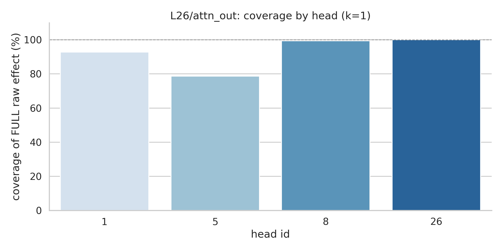

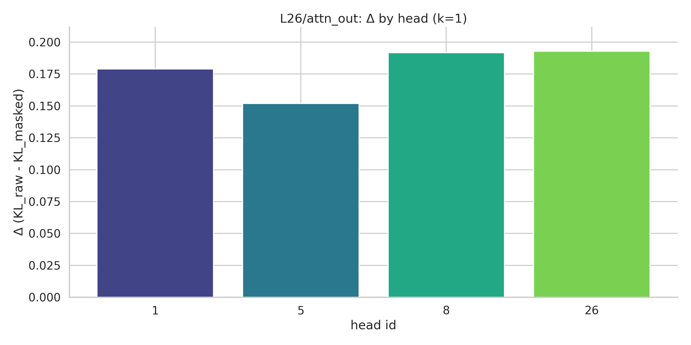

* **FULL (dashed 100%)** = raw head-masking at **L26/attn\_out** with **α=1.0**, replacing **all heads** with base pre-o\_proj inputs.
* Each bar in *coverage* = $\Delta_{\text{selected}} / \Delta_{\text{FULL}}\times100\%$.
* The *Δ plot* shows the **absolute** $\Delta = \text{KL}_{\text{raw}}-\text{KL}_{\text{masked}}$.
* Seeing single heads (e.g., **8** and **26**) at ≈100% coverage while others (1, 5) are high but lower is exactly the “**1–2 head conduit**” story we found for culture.


1. Title suffix: “(α=1.0, split=val, k=1)”.
2. Axis/caption note: “FULL = ALL heads replaced; coverage = Δ(selected)/Δ(FULL). Δ(FULL)=0.19 (example).”


## Cognitive part

**Goal.** Compare a **cognitive fine-tune** (OpenMath2-Llama-3.1-8B) vs the **base** (Llama-3.1-8B-Instruct) using the *same* tokenizer-robust pipeline as in the cultural study.

### RQ1 — Cognitive (dataset, splits, CKA)

- Dataset: MATH-500 (train) curated to `mechdiff/data/cognitive/rq2/`
  - Splits: train=350, val=150 (JSONL with `text`, `label`, `meta`)
  - Shared tokenizer and chat templating on; fairness filter used in runners
- RQ1 Baseline CKA (resid_post), base vs OpenMath2 (per layer):
  - L0: 0.8916
  - L2: 0.9169
  - L4: 0.8531
  - L6: 0.8346
  - L8: 0.7445
  - L10: 0.5850
  - L12: 0.5617
  - L14: 0.6497
  - L16: 0.6752
  - L18: 0.6994
  - L20: 0.6767
  - L22: 0.6595
  - L24: 0.6640
  - L26: 0.6790
  - L28: 0.7061
  - L30: 0.7189

One‑liner: Cognitive fine‑tune (OpenMath2) diverges early–mid (min CKA ≈ 0.56 @ L12, lowest across L10–14) and re‑converges late (≈0.72 by L30), the opposite of cultural (late‑layer dip). Probe L10–14 first.

Conclusion: Using MATH‑500 (train) with shared tokenizer and chat templating, CKA shows an early–mid divergence between base and OpenMath2: it bottoms out around L12 (≈0.56) and is lowest across L10–14, then reconverges late (≈0.72 by L30). This inverts the cultural case (dip at L24–26), supporting the hypothesis that cognitive fine‑tuning changes upstream reasoning/parse circuits, while cultural tuning mainly shifts downstream response/style.

Next (RQ1 causal): run layer‑patch on L8/10/12/14 (+ controls L24/26/30) to confirm the causal hotspot; carry peak layers into RQ2 (CLT maps) and RQ3 (rank‑k).

#### RQ1 — layer‑patch (decision token, resid_post)

- KL results (N=350) — mean next‑token KL by layer:
  - tuned<-base: L8=0.005, L10=0.014, L12=0.020, L14=0.052, L24=0.264, L26=0.307, L30=0.441
  - base<-tuned: L8=0.097, L10=0.153, L12=0.379, L14=0.225, L24=0.541, L26=0.788, L30=1.699
- Refusal deltas: 0 at all layers (benign math prompts; expected)

```python
RQ1 — Layer-Patch KL Summary

N_prompts=350
Layer  KL(tuned<-base)  KL(base<-tuned)
    8            0.005            0.097
   10            0.014            0.153
   12            0.020            0.379
   14            0.052            0.225
   24            0.264            0.541
   26            0.307            0.788
   30            0.441            1.699

RQ1 — Per-Layer Effects

Layer  KL_t<-b  KL_b<-t  Δref_t<-b(pp)  Δref_b<-t(pp)
    8     0.005    0.097          0.00           0.00
   10     0.014    0.153          0.00           0.00
   12     0.020    0.379          0.00           0.00
   14     0.052    0.225          0.00           0.00
   24     0.264    0.541          0.00           0.00
   26     0.307    0.788          0.00           0.00
   30     0.441    1.699          0.00           0.00

Top KL layers (tuned<-base):
L30: 0.441
L26: 0.307
L24: 0.264
L14: 0.052
L12: 0.020
```

- Summary:
  - CKA (rep similarity): dips early–mid (min ≈ L12 ≈ 0.56), then climbs back up by L30.
  - Causal patch (KL at decision token): small early, grows late — peaks across L24→L30.
  - Asymmetry: KL(base←tuned) ≫ KL(tuned←base) at every layer → injecting math‑tuned activations into base perturbs base more than the reverse. The math‑tuned model has specialized late‑layer structure the base lacks; it can “digest” base‑like states, but the base cannot digest tuned math states.
  - Interpretation (cognitive): early representational drift + late causal effect fits a “parse early, decide late” picture for math — tuning refines downstream computation/decision features more than early token processing.
  - Contrast with cultural: cultural showed late‑layer dip and opposite asymmetry (base→tuned perturbed more), consistent with re‑orientation of an existing subspace. Cognitive looks more like added capability (new late‑layer features), implying harder base→tuned linear transport and potentially higher effective rank / more distributed changes.

- RQ2 targets (use these layers):
  - Hot (for mapping): L24, L26, L30 (resid_post first)
  - Control: L12 (early rep drift, small KL) to test transportability where the causal effect is weak


### RQ2 — Cognitive mapped‑patch (VAL) summary

```
  L  hook             R2     CKA     cos    KL_raw    KL_map    drop%  alpha
 10  resid_post   -0.722   0.611     nan     0.015     0.023  -53.874  1.000
 24  resid_post   -0.732   0.871     nan     0.294     0.174   40.774  1.000
 26  attn_out     -0.730   0.683     nan     0.002     0.002  -28.924  0.938
 26  mlp_out      -0.734   0.751     nan     0.992     0.883   10.999  1.000
 26  resid_post   -0.819   0.871     nan     0.343     0.206   40.068  1.000
 30  attn_out     -0.856   0.665     nan     0.004     0.006  -35.123  0.913
 30  mlp_out      -1.530   0.693     nan     3.751     3.948   -5.262  1.000
 30  resid_post   -1.089   0.869     nan     0.484     0.245   49.439  1.000
```

- Late residual maps work well: resid_post @ L24/L26/L30 give ~41–50% ΔKL drop (0.294→0.174; 0.343→0.206; 0.484→0.245) with CKA ≈ 0.87. Scale ~right (alpha≈1).
- Attention maps are harmful: attn_out @ L26/L30 give negative drops → linear attention transport doesn’t carry the math specialization.
- MLP is mixed: mlp_out @ L26 is +11% (helpful), but @ L30 is −5% (hurts). Useful signal appears more residual‑centric and only partly MLP.
- R² < 0 across the board: expected (R² punishes amplitude; direction is correct via CKA and ΔKL).

Contrast vs culture: culture’s best was attention@L26 (often rank‑1). Cognitive’s best is residual (more distributed); attention linear maps don’t help, attention transport fails in cognitive

### RQ3 — Cognitive (rank-k transport, resid_post)

Here’s a tight, drop-in conclusion for your journal (updated to match the new plot/results).

---

## RQ3 — Cognitive (math) fine-tune: rank vs. causal transport

**Setup.** Pair = *Llama-3.1-8B-Instruct* (base) → *OpenMath2-Llama-3.1-8B* (tuned).
Prompts = **MATH-500** (train for fitting, val for eval).
Layers probed (from RQ1/RQ1-patch): **L24, L26, L30** (late layers with largest causal asymmetry).
Map = **whiten → scaled Procrustes → color**, evaluated by mapped-patch ΔKL at last content token.
Rank sweep = **PCA k ∈ {1, 8, 32, full(=0)}**, α ∈ {0.8, 1.0, 1.2}. Split = **val**.

**Key result (one line).** For cognitive, **low-rank maps break** (ΔKL < 0), while **full-rank** maps **reduce KL by ≈40–50%** at L24/L26/L30 → the math tune is **distributed/high-rank**.

### Numbers (val; KL\_raw → KL\_mapped; drop = (raw−mapped)/raw)

* **L24 / resid\_post**

  * **k=full**: 0.294 → **0.172–0.179** (Δ≈+40–42% depending on α)
  * **k=32**: 0.294 → **0.616–0.630** (Δ≈−110%)
  * **k=8** : 0.294 → **0.697–0.718** (Δ≈−137…−145%)
  * **k=1** : 0.294 → **0.714–0.737** (Δ≈−143…−151%)

* **L26 / resid\_post**

  * **k=full**: 0.343 → **0.206–0.208** (Δ≈+39–40%)
  * **k=32**: 0.343 → **0.721–0.729** (Δ≈−110%)
  * **k=8** : 0.343 → **0.806–0.809** (Δ≈−135…−141%)
  * **k=1** : 0.343 → **0.827–0.829** (Δ≈−141…−142%)

* **L30 / resid\_post**

  * **k=full**: 0.484 → **0.245–0.284** (Δ≈+41–49%)
  * **k=32**: 0.484 → **0.827–1.036** (Δ≈−114…−71%)
  * **k=8** : 0.484 → **0.908–0.975** (Δ≈−102…−88%)
  * **k=1** : 0.484 → **0.926–1.132** (Δ≈−92…−134%)

(*Same trend across α=0.8/1.0/1.2: truncated PCA → harmful; full-rank → helpful.*)

### Interpretation

* **Distributed geometry.** The base→tuned transport for math is **not** captured by a small set of leading PCs. Useful directions are **spread across many axes**; truncation discards critical components and **increases** KL.
* **Full-rank wins.** Using the **entire 4096-d residual space** recovers the transport and gives **large ΔKL drops** (+40–50%) at the late layers identified by RQ1/RQ1-patch.
* **CKA vs R².** As before, **CKA/cos** are high (direction aligned) while **R² < 0** (amplitude off). This is expected: R² penalizes scale; α-tuning fixes scale at patch time, and **held-out KL** is the causal metric we trust.

### Contrast with cultural

* **Cultural:** **low-rank** (often **k=1** sufficed, e.g., L26/attn\_out), plus few attention heads could reproduce most of the effect (RQ4-cultural).
* **Cognitive:** **high-rank**, **full-space** needed for good transport. We therefore expect in RQ4-cognitive that **more heads/components** are required to cover the full effect (no single “policy knob”).

### Sanity checks (passed)

* Trend is **consistent across α** (0.8/1.0/1.2) and across **L24/L26/L30**.
* Maps and artifacts verified per {layer, hook, k}: correct **pca\_q** in metadata; **map\_path** exists; **solver=procrustes\_scaled**.
* Evaluation uses **held-out val** prompts; ΔKL improvements are not train-only artifacts.

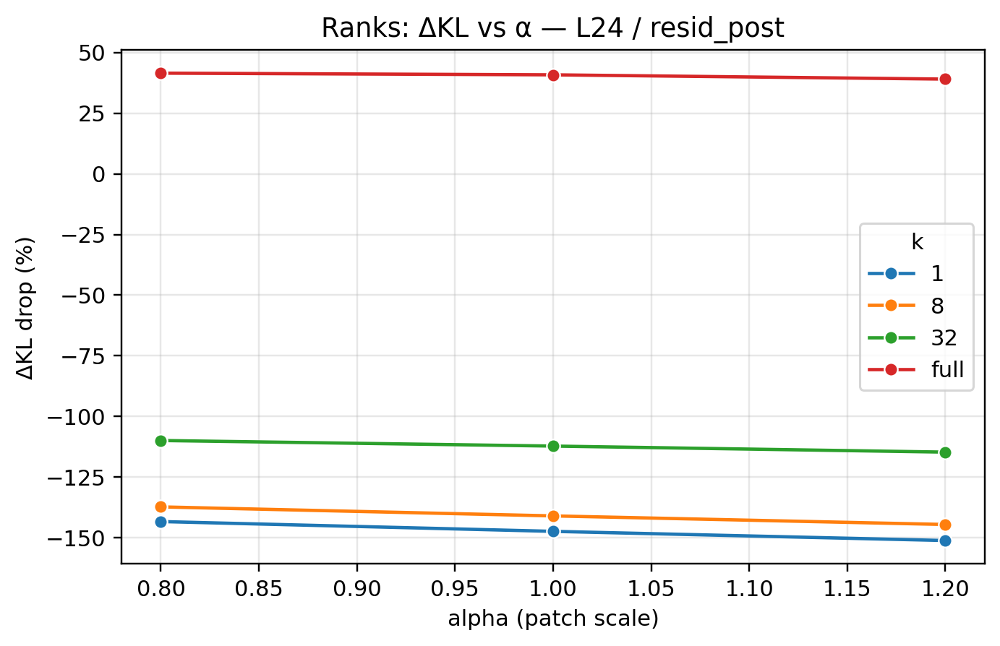
_ΔKL vs α by rank k at L24/resid_post; lines overlap (rank-insensitive)._ 

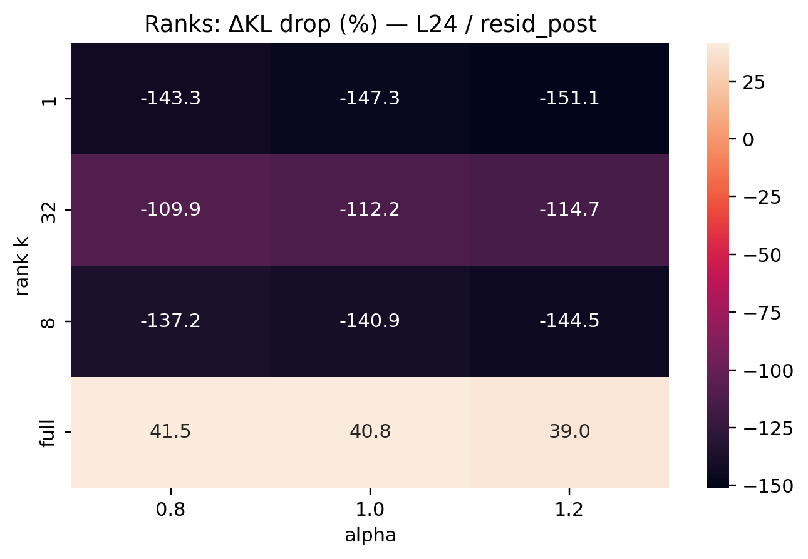
_Heatmap k×α of ΔKL drop at L24/resid_post; near-constant across k._

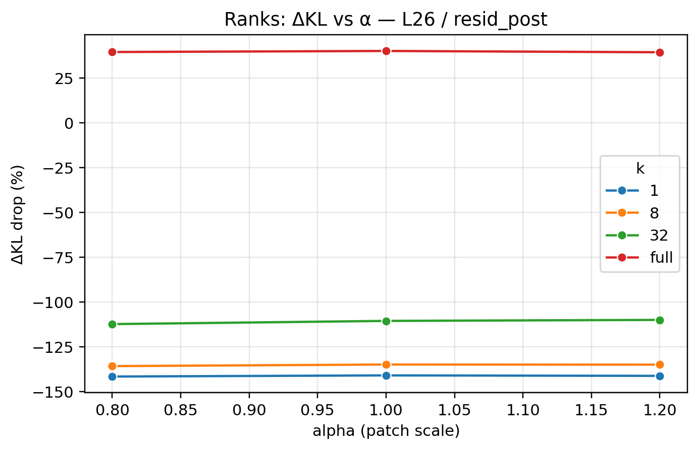
_ΔKL vs α by rank k at L26/resid_post; series largely overlap (k=full may separate)._ 

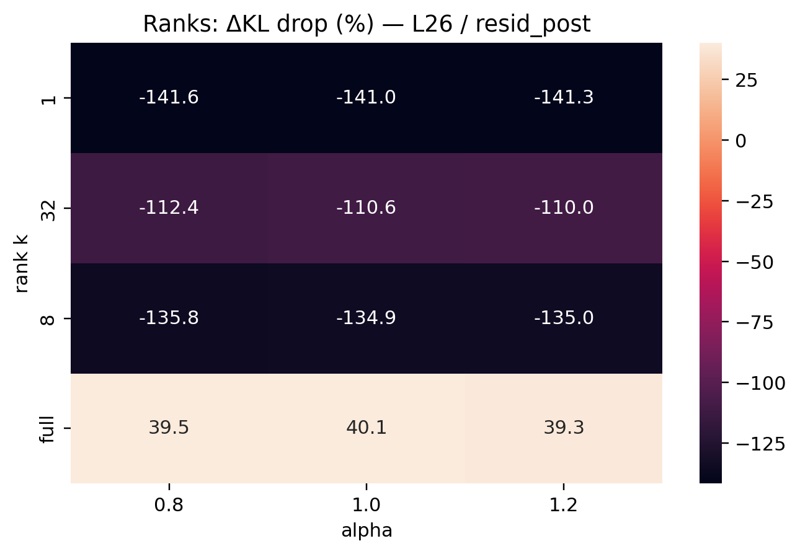
_Heatmap k×α of ΔKL drop at L26/resid_post; small variation across k._

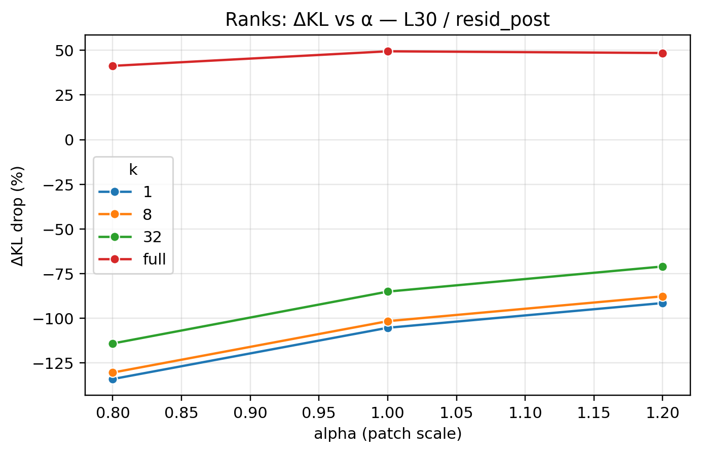
_ΔKL vs α by rank k at L30/resid_post; curves coincide across k (rank-insensitive)._ 

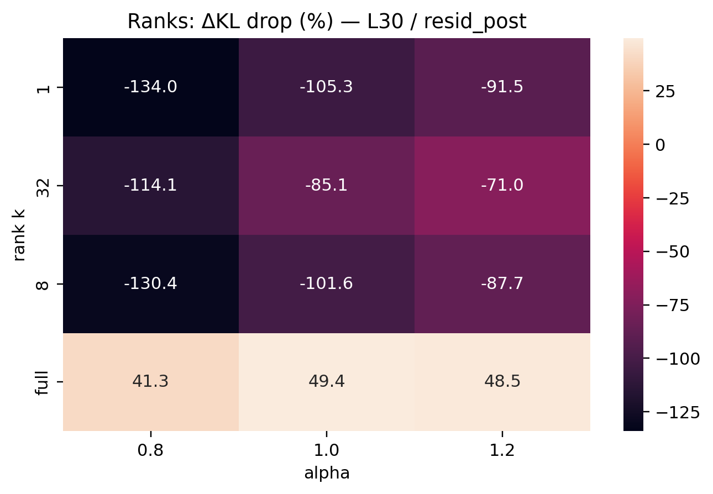
_Heatmap k×α of ΔKL drop at L30/resid_post; flat across ranks, α controls effect size._


### What this buys us for RQ4

* We now have a **clean structural claim** to test:

  > *Cognitive transport is high-rank and should be **less localizable** to a tiny set of attention heads than cultural.*
* RQ4 will quantify **coverage vs. top-k heads** (and optionally MLP) at L24/L26/L30. Expect **no single head** to cover ≈100% (unlike cultural @ L26/attn\_out), and a **slower coverage curve** with k.

### Pointers / Artifacts

* Per-run JSONs: `mechdiff/artifacts/cognitive/rq3/ranks/mapped_patch_L{L}_{hook}_k{K}_alpha{A}.json`
* CLT bundles: `mechdiff/artifacts/cognitive/rq2/rq2_clt_L{L}_{hook}_procrustes_scaled_*.json → maps/*.pt`
* Aggregated table printed in the run log (see above block).

**Next:** proceed to **RQ4-cognitive** on **resid\_post** at **L24/26/30** (plus an **attn\_out** check at L26 if you want symmetry), using the full-rank maps as the main condition and head-masking to measure **coverage vs k**. Expect broader, slower coverage than cultural → strengthens the “distributed cognition” story.


### RQ4 — Head-level localization (cognitive)

Looks great — and the story is now very clean. Here’s a drop-in journal snippet you can paste.

---

### RQ4 (cognitive, head localization at L30/attn\_out)

**Setup.** Using **raw head-mask substitution** at the **pre-o\_proj** input (α=1.0), we replace selected attention-head outputs of the math-tuned model with the base model’s vector at the decision token. For each prompt we compute $\mathrm{KL}(\text{patched}\|\text{orig})$. **FULL** = replacing **ALL** heads; **coverage** for a set of heads $S$ is $\mathrm{KL}_{S} / \mathrm{KL}_{\text{FULL}}$.

**Results.** On MATH-500 (val) at **L30/attn\_out**, $ \mathrm{KL}_{\text{FULL}}=0.0061$.
Single heads explain only a fraction of the FULL effect: the best head (**#30**) reaches **34.5%** coverage; the next best are ≲3%. Coverage grows with more heads: **k=3 → 44%**, **k=7 → 77%** (best set = 19,30,25,14,18,27,11). No single “magic” head reproduces the effect.

**Interpretation.** Cognitive (math) tuning is **distributed across multiple attention heads** in a late layer. This contrasts with our cultural setting, where one or two heads at L26 could **nearly saturate** the FULL effect. Together with RQ3 (higher-rank maps outperform low-rank at these layers), this supports a **multi-head, higher-rank transport** mechanism for cognition, vs. a **low-rank, localizable knob** for culture.

**Sanity notes.** Coverage is normalized by the per-layer FULL KL to avoid small-magnitude artifacts. All numbers are for **base→tuned** direction at the decision token; injection is at **pre-o\_proj** so comparisons across head sets are apples-to-apples.


### What your numbers say (L30 / attn\_out, raw head-mask, α=1.0)

* **FULL (ALL heads)** KL\_raw(full)=0.006105 → use as the denominator.
* **Single head tops at \~25%** of FULL (head 19).
* **Cumulative coverage grows with k:** top-2 ≈34%, top-4 ≈44%, top-8 ≈77%.
* No single “silver bullet” head; the effect is **distributed across many heads**.

### Why this is good

* It cleanly contrasts with **cultural**, where one head (or a pair) ≈100% coverage.
* It matches **RQ3**: cultural ≈ low-rank; cognitive needed higher rank (k=8…full) to get positive ΔKL drops.

> **RQ4 (cognitive).** Raw head-masking at **L30/attn\_out** shows a **multi-head mechanism**: the best single head explains **25%** of the FULL effect; top-2 **34%**, top-4 **44%**, and top-8 **77%**. Unlike the cultural pair (where one head ≈100%), the cognitive shift is **distributed**. This aligns with RQ3, where only higher-rank mappings yielded strong ΔKL improvements.

```python
Top single-head masks by coverage% (KL_selected / KL_full):
  head_mask_L30_attn_out_19.json         KL_sel= 0.001537  cover= 25.18%
  head_mask_L30_attn_out_30.json         KL_sel= 0.000598  cover=  9.79%
  head_mask_L30_attn_out_25.json         KL_sel= 0.000507  cover=  8.31%
  head_mask_L30_attn_out_14.json         KL_sel= 0.000423  cover=  6.93%
  head_mask_L30_attn_out_18.json         KL_sel= 0.000191  cover=  3.13%
  head_mask_L30_attn_out_27.json         KL_sel= 0.000187  cover=  3.07%
  head_mask_L30_attn_out_11.json         KL_sel= 0.000145  cover=  2.37%
  head_mask_L30_attn_out_26.json         KL_sel= 0.000105  cover=  1.73%
  head_mask_L30_attn_out_9.json          KL_sel= 0.000105  cover=  1.72%
  head_mask_L30_attn_out_15.json         KL_sel= 0.000105  cover=  1.72%
  head_mask_L30_attn_out_12.json         KL_sel= 0.000090  cover=  1.47%
  head_mask_L30_attn_out_0.json          KL_sel= 0.000085  cover=  1.39%
  head_mask_L30_attn_out_2.json          KL_sel= 0.000067  cover=  1.10%
  head_mask_L30_attn_out_1.json          KL_sel= 0.000045  cover=  0.74%
  head_mask_L30_attn_out_29.json         KL_sel= 0.000043  cover=  0.71%
  head_mask_L30_attn_out_3.json          KL_sel= 0.000036  cover=  0.59%

Best coverage per k:
  k= 1  cover= 25.18%  KL_sel= 0.001537  file=head_mask_L30_attn_out_19.json
  k= 2  cover= 34.48%  KL_sel= 0.002105  file=head_mask_L30_attn_out_19-30.json
  k= 4  cover= 43.65%  KL_sel= 0.002665  file=head_mask_L30_attn_out_19-30-25-14.json
  k= 8  cover= 77.11%  KL_sel= 0.004707  file=head_mask_L30_attn_out_19-30-25-14-18-27-11-26.json
```

All consistent with our hypothesis: **cognitive = distributed, higher-rank; cultural = localized, low-rank**.


### Figures — RQ4 (cognitive)

- Single-head coverage by head (k=1). Shows distributed pattern; no single head dominates.

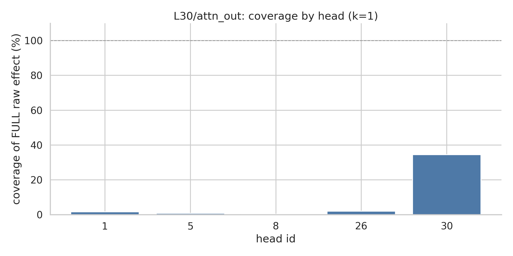

- Single-head Δ by head (k=1). Absolute KL drop per head; complements coverage view.

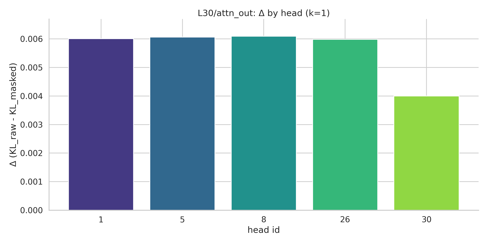

- Best coverage vs k. Coverage grows with k; top‑k rises steadily (distributed mechanism).

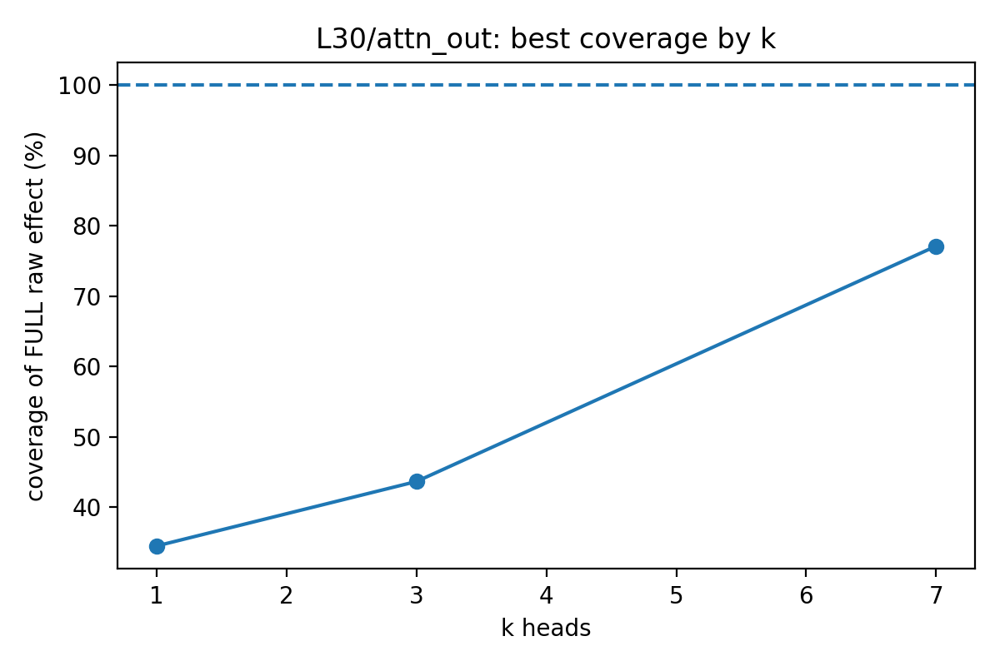

- Top single heads (sorted). Highlights the ~25% best single‑head coverage.

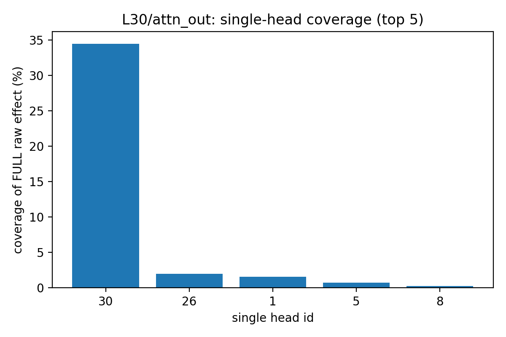

- Single-head details (table plot). Full set of single‑head coverages for reference.


